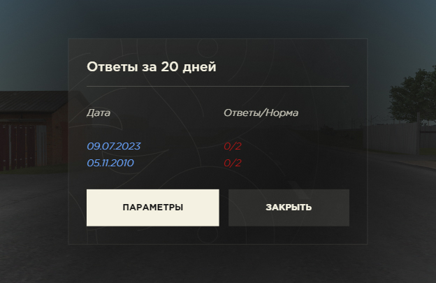
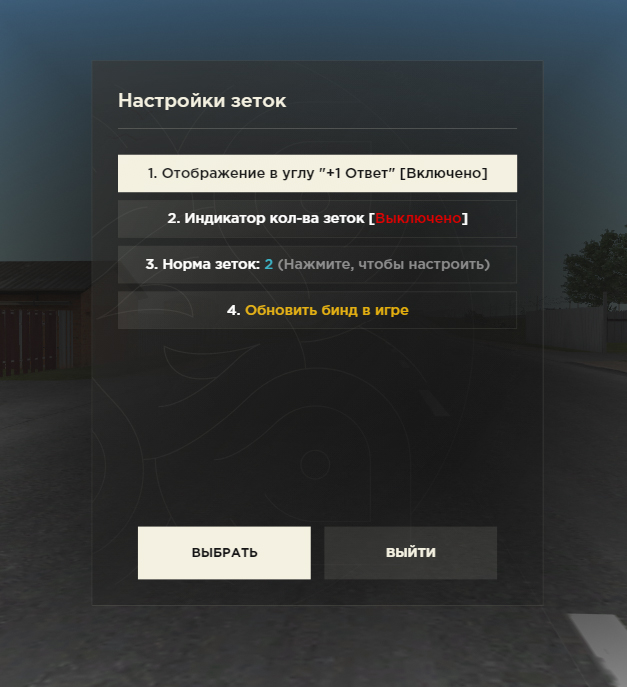

	 
	 
	
	 
	
Удобный счетчик /z для Саппортов проекта Radmir CRMP

	<strong><a href='https://github.com/zFriks/replies/releases/download/v1.7.3/Replies.1.7.3.zip'>Скачать</a> | <a href='https://youtu.be/oB5KfsDb1iU'>Как установить</a></strong>  
	<strong>Если возникли вопросы, вот мой <a href='https://vk.com/zfriks'>ВК</a> </strong>
	 
	 

# Правила использования скрипта:
1. Это официальная страница скрипта Replies! ⚠️
2. Незнание правил не освобождает Вас от ответственности! ⚠️
3. Скрипт доступен для БЕЗОПАСНОГО скачивания ТОЛЬКО НА ГИТХАБЕ по этой ссылке( https://github.com/zFriks/replies ).⚠️
4. При распростренении кидать эту ссылку ( https://github.com/zFriks/replies )!⚠️
5. Скрипт, размещенный на других ресурсах может являться ПОДДЕЛЬНЫМ и СКАЧИВАНИЮ НЕ ПОДЛЕЖИТ! ❌
6. Разработчик не несет ответственности за Ваш аккаунт, если скрипт скачан с иного источника! ❌
7. Если кто-то кидает Вам в ЛС скрипт не официальной ссылкой, а ссылкой на сторонний сайт или же просто файлом, НЕ СКАЧИВАЙТЕ! Это может оказаться подделкой со стиллером!❌ 

При скачивании скрипта, Вы АВТОМАТИЧЕСКИ принимаете правила использования скрипта и берете всю ответственность на себя!

### Возникли вопросы по использованию модификации? Пишите: https://vk.com/zfriks

# Как работает скрипт?
Ваша задача - отвечать на вопросы игроков, а скрипт все сделает за вас! После каждоого ответа появится такое сообщение (в настройках можно отключить):

# Как посмотреть ответы?
Нажмите на клавиатуре клавишу P (англ), чтобы посмотреть кол-во отвеченных зеток

# [НОВОВВЕДЕНИЕ] Индикатор отвеченных зеток (включается в параметрах).
Также с этим обновлением добавлен полезный индикатор, показывающий кол-во отвеченных зеток на экране. Его можно переместить в любую часть экрана зажатием ЛКМ.

# Установка
Скачайте скрипт по ссылке: https://github.com/zFriks/replies/releases/latest

И делайте как показано в видео: https://youtu.be/oB5KfsDb1iU

